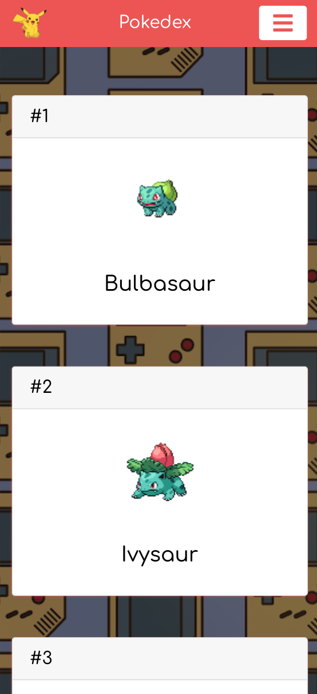
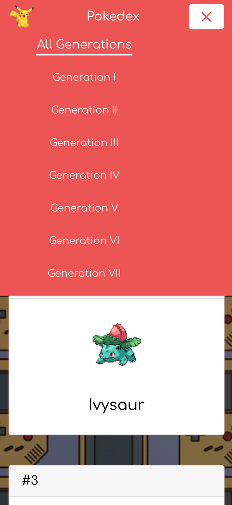
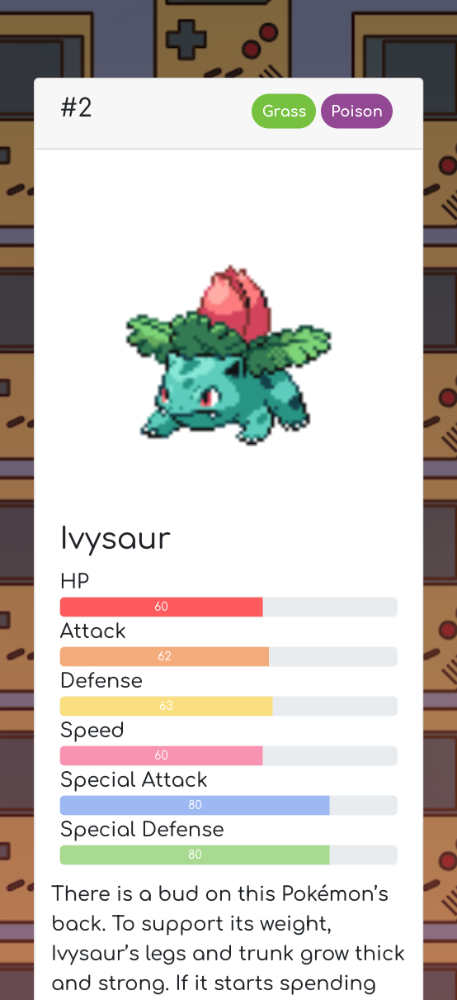
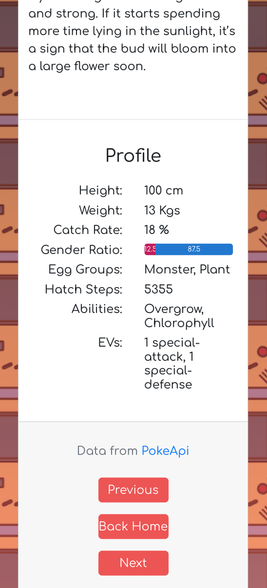

<h1 align="center">
    
</h1>
<h1 align="center">
    
</h1>
<h1 align="center">
    
</h1>
<h1 align="center">
    
    
</h1>
<h1 align="center">
    
    
</h1>

## 💻 About project

Personal project built using ReactJS and Bootstrap 4, with axios for Poke API requests. It is a pokedex which contains pokemons from all generations, where you can access the data of each pokemon. As a pokemon fan, this is the pokedex that I always wanted and I'm really grateful that I could make it. Also, I could learn a lot about using bootstrap with react. Feel free to access the site via netlify and enjoy it.

## 🛠 Technology

#### **Website**

-   **[HTML5](https://developer.mozilla.org/pt-BR/docs/Web/HTML/HTML5)**
-   **[CSS3](https://www.w3schools.com/css/)**
-   **[Bootstrap 4](https://getbootstrap.com/)**
-   **[ReactJs](https://pt-br.reactjs.org/)** : **[Styled-Components](https://styled-components.com/)**, **[React Icons](https://react-icons.github.io/react-icons/)**, **[react-router-dom](https://reactrouter.com/web/guides/quick-start)**
-   **[Axios](https://www.npmjs.com/package/axios)**

#### **Utilitaries**

-   Editor: **[Visual Studio Code](https://code.visualstudio.com/)**
-   API: **[Poke API](https://pokeapi.co/)**
-   Fonts: **[Comfortaa](https://fonts.google.com/specimen/Comfortaa)**

### Prerequisites

Before you begin, you will need to have the following tool installed on your machine:
[Git](https://git-scm.com)

In addition, it is good to have an editor to work with the code as **[VSCode](https://code.visualstudio.com/)**

### Running the web application (Front End)

```bash
# Clone this repository
$ git clone https://github.com/luizmr/pokedex-app.git

# Access the project folder in the cmd/terminal
$ cd pokedex-app

# Use the command below to install all dependencies
$ npm install

# Install http-server
$ npx http-server

# Run the application on terminal
$ npm start

# The server is now running at localhost:3000
```

## 📝 License

This project is under the MIT license.

Made with ❤️ by Luiz Marcelo Rocha
